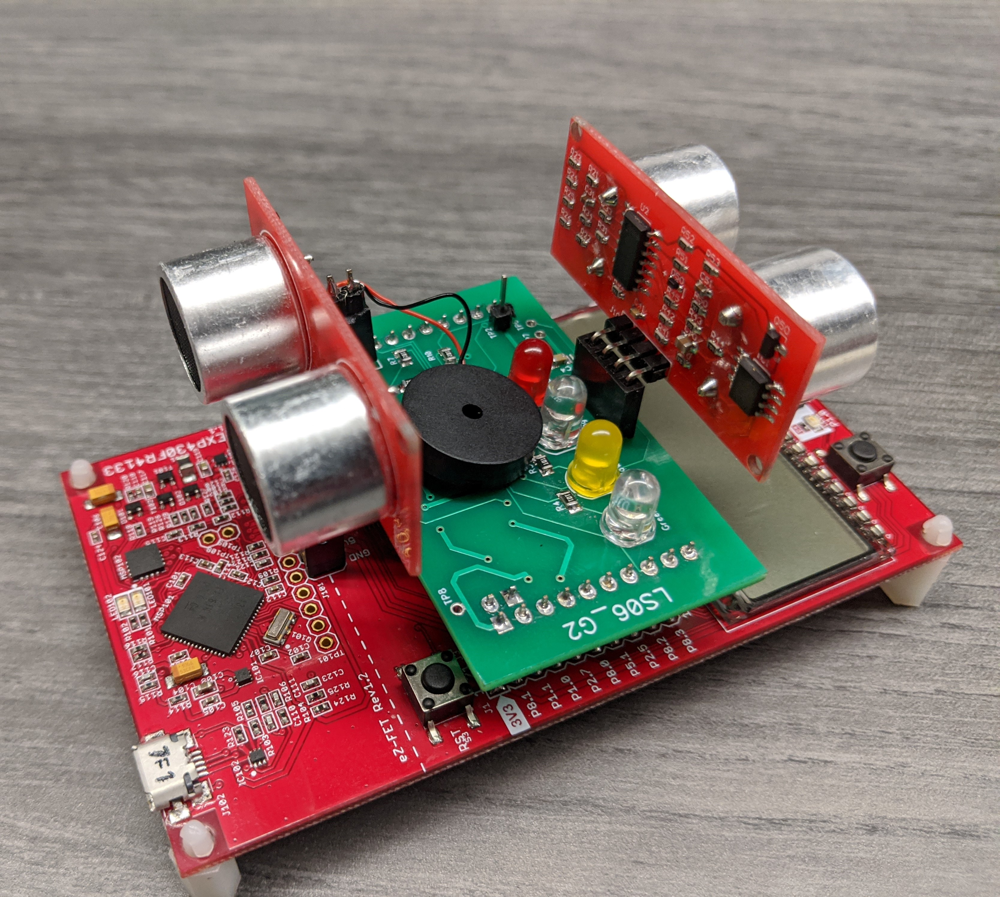
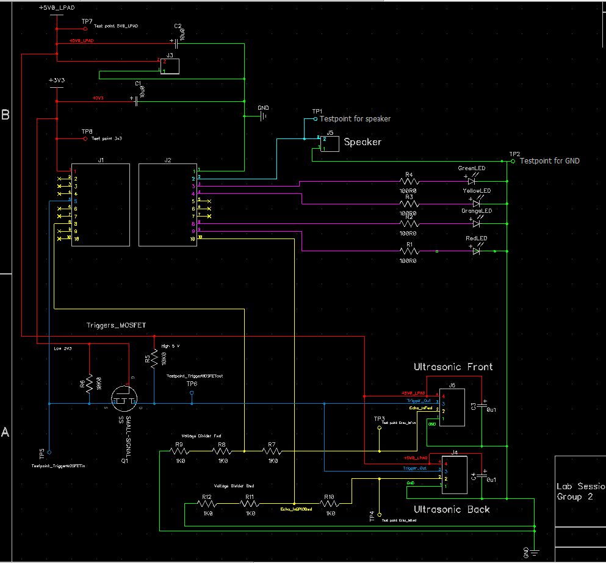
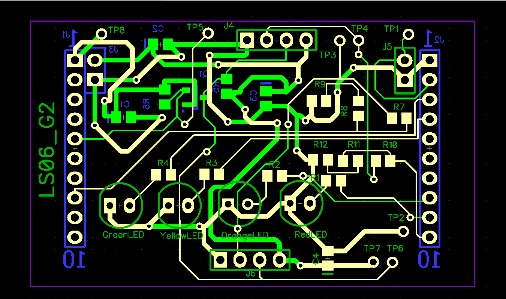
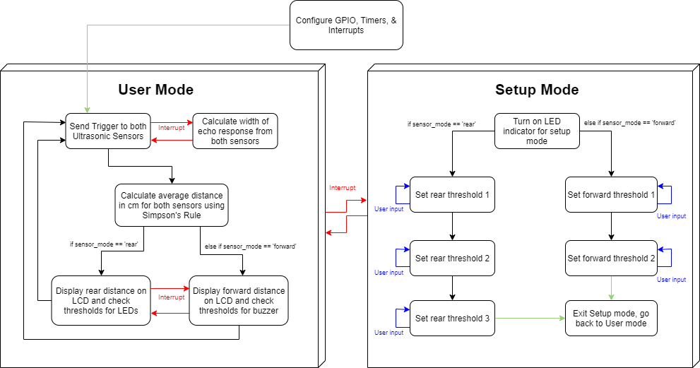

# Bicycle Sensor

## Problem Statement
Bicyclists often have difficulty navigating roads, as roads are dominated by automotive vehicles and is a dangerous environment for a slow-moving vehicle like a bicycle. Bicyclists don’t take up much space on the road and can be hard to spot in low visibility conditions such as fog or low light. Due to the lack of light intensity on a bicycle, bicyclists themselves also may have a hard time spotting obstacles in certain conditions. The aim is to design a system that involves two ultrasonic sensors, one for the forward, and one for the rear direction, that can alert the bicyclist and others on the road to oncoming danger.

## Hardware Design
The hardware design involves a printed circuit board interfaced with 2 ultrasonic sensors, 4 LEDs, and a piezoelectric buzzer. The development environment this board was created for is the [Texas Instruments MSP430](http://www.ti.com/microcontrollers/msp430-ultra-low-power-mcus/overview.html) family of MCUs. The exact MCU used for this project is the [MSP430FR4133](http://www.ti.com/product/MSP430FR4133).

[DipTrace](https://diptrace.com/) was used for the circuit schematic and PCB design, the files can be found under the 'Prototype Design' directory.

## Software Design
The software was designed as a state machine, with state transitions facilitated through GPIO interrupts. The distance from either the forward or rear facing direction is displayed in centimeters on an LCD, and the direction can be toggled through a button press. Each direction has configurable proximity thresholds, the rear thresholds are indicated through LEDs, and the forward thresholds through a piezoelectric speaker.

## Group Members:
* [Waleed Ahmed](https://github.com/w29ahmed)
* [Sibghat Shah](https://github.com/Sibcgh)
